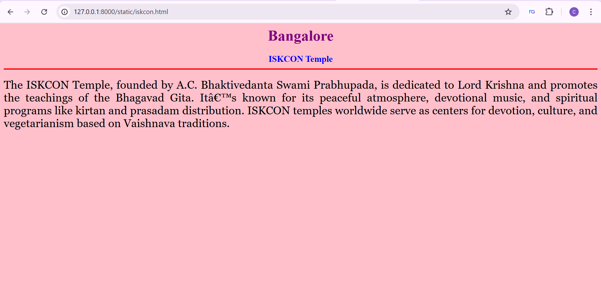
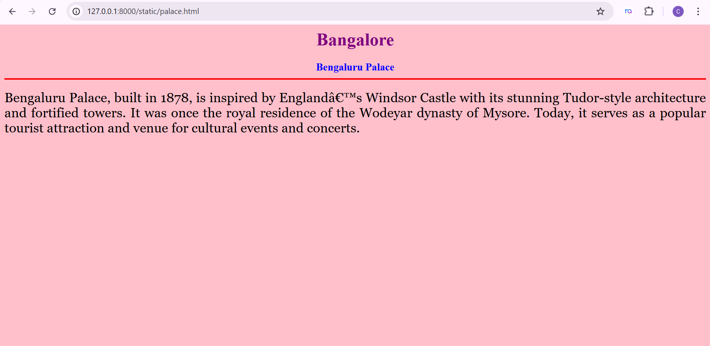
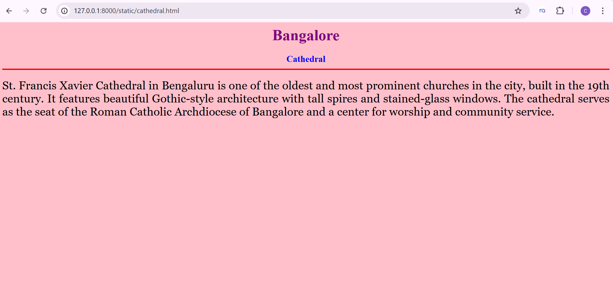
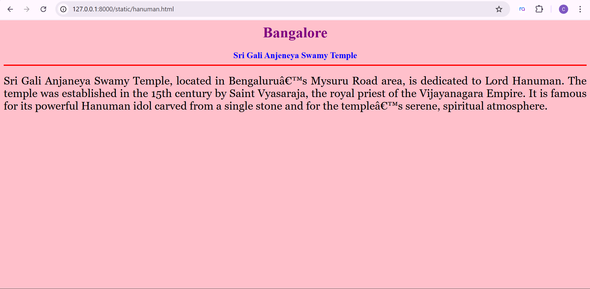
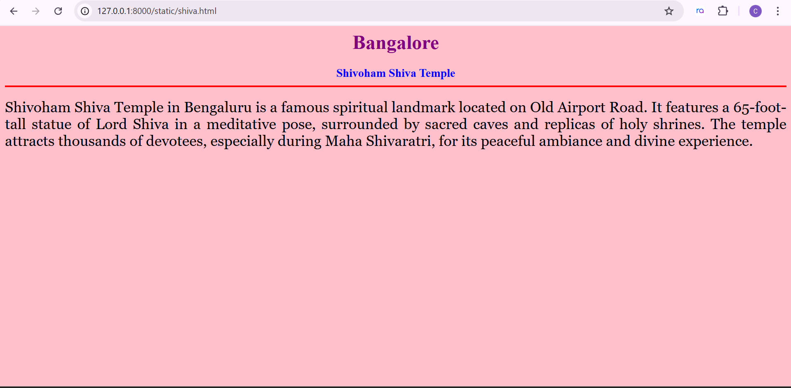

# Ex04 Places Around Me
## Date: 24/10/2025

## AIM
To develop a website to display details about the places around my house.

## DESIGN STEPS

### STEP 1
Create a Django admin interface.

### STEP 2
Download your city map from Google.

### STEP 3
Using ```<map>``` tag name the map.

### STEP 4
Create clickable regions in the image using ```<area>``` tag.

### STEP 5
Write HTML programs for all the regions identified.

### STEP 6
Execute the programs and publish them.

## CODE
```
map.html

<html>
    <head>
        <title>My City</title>
    </head>
    <body>
        <h1 align="center">
            <font color="red"><b>BANGALORE</b></font>
        </h1>
        <h3 align="center">
            <font color="blue"><b>A Chandhna (212224040051)</b></font>
        </h3>
        <center>


<map name="image-map">
    <area target="" alt="iskcon " title="iskcon " href="iskcon.html" coords="603,32,804,174" shape="rect">
    <area target="" alt="palace" title="palace" href="palace.html" coords="905,106,1087,214" shape="rect">
    <area target="" alt="cathedral" title="cathedral" href="cathedral.html" coords="1134,144,1382,269" shape="rect">
    <area target="" alt="hanuman temple" title="hanuman temple" href="hanuman.html" coords="429,491,645,570" shape="rect">
    <area target="" alt="shiva temple" title="shiva temple" href="shiva.html" coords="1468,441,1780,525" shape="rect">
</map>

             
        </center>
    </body>
</html>

iskcon.html

<html>
    <head>
        <title>My hometown</title>
    </head>
    <body bgcolor="pink">
        <h1 align="center">
            <font color="purple"><b>Bangalore</b></font>
        </h1>
        <h3 align="center">
            <font color="blue"><b>ISKCON Temple</b></font>
            <hr size="3" color="red">
        </h3>
        <p align="justify">
            <font face="Georgia" size="5">
                The ISKCON Temple, founded by A.C. Bhaktivedanta Swami Prabhupada, is dedicated to Lord Krishna and promotes the teachings of the Bhagavad Gita.
It’s known for its peaceful atmosphere, devotional music, and spiritual programs like kirtan and prasadam distribution.
ISKCON temples worldwide serve as centers for devotion, culture, and vegetarianism based on Vaishnava traditions.
            </font>
        </p>
    </body>
</html>

palace.html

<html>
    <head>
        <title>My hometown</title>
    </head>
    <body bgcolor="pink">
        <h1 align="center">
            <font color="purple"><b>Bangalore</b></font>
        </h1>
        <h3 align="center">
            <font color="blue"><b>Bengaluru Palace</b></font>
            <hr size="3" color="red">
        </h3>
        <p align="justify">
            <font face="Georgia" size="5">
                Bengaluru Palace, built in 1878, is inspired by England’s Windsor Castle with its stunning Tudor-style architecture and fortified towers.
It was once the royal residence of the Wodeyar dynasty of Mysore.
Today, it serves as a popular tourist attraction and venue for cultural events and concerts.
            </font>
        </p>
    </body>
</html>

cathedral.html

<html>
    <head>
        <title>My hometown</title>
    </head>
    <body bgcolor="pink">
        <h1 align="center">
            <font color="purple"><b>Bangalore</b></font>
        </h1>
        <h3 align="center">
            <font color="blue"><b>Cathedral</b></font>
            <hr size="3" color="red">
        </h3>
        <p align="justify">
            <font face="Georgia" size="5">
                St. Francis Xavier Cathedral in Bengaluru is one of the oldest and most prominent churches in the city, built in the 19th century.
It features beautiful Gothic-style architecture with tall spires and stained-glass windows.
The cathedral serves as the seat of the Roman Catholic Archdiocese of Bangalore and a center for worship and community service.
            </font>
        </p>
    </body>
</html>

hanuman.html

<html>
    <head>
        <title>My hometown</title>
    </head>
    <body bgcolor="pink">
        <h1 align="center">
            <font color="purple"><b>Bangalore</b></font>
        </h1>
        <h3 align="center">
            <font color="blue"><b>Sri Gali Anjeneya Swamy Temple</b></font>
            <hr size="3" color="red">
        </h3>
        <p align="justify">
            <font face="Georgia" size="5">
                Sri Gali Anjaneya Swamy Temple, located in Bengaluru’s Mysuru Road area, is dedicated to Lord Hanuman.
The temple was established in the 15th century by Saint Vyasaraja, the royal priest of the Vijayanagara Empire.
It is famous for its powerful Hanuman idol carved from a single stone and for the temple’s serene, spiritual atmosphere.
            </font>
        </p>
    </body>
</html>

shiva.html

<html>
    <head>
        <title>My hometown</title>
    </head>
    <body bgcolor="pink">
        <h1 align="center">
            <font color="purple"><b>Bangalore</b></font>
        </h1>
        <h3 align="center">
            <font color="blue"><b>Shivoham Shiva Temple</b></font>
            <hr size="3" color="red">
        </h3>
        <p align="justify">
            <font face="Georgia" size="5">
                Shivoham Shiva Temple in Bengaluru is a famous spiritual landmark located on Old Airport Road.
It features a 65-foot-tall statue of Lord Shiva in a meditative pose, surrounded by sacred caves and replicas of holy shrines.
The temple attracts thousands of devotees, especially during Maha Shivaratri, for its peaceful ambiance and divine experience.
            </font>
        </p>
    </body>
</html>

```

## OUTPUT









## RESULT
The program for implementing image maps using HTML is executed successfully.
